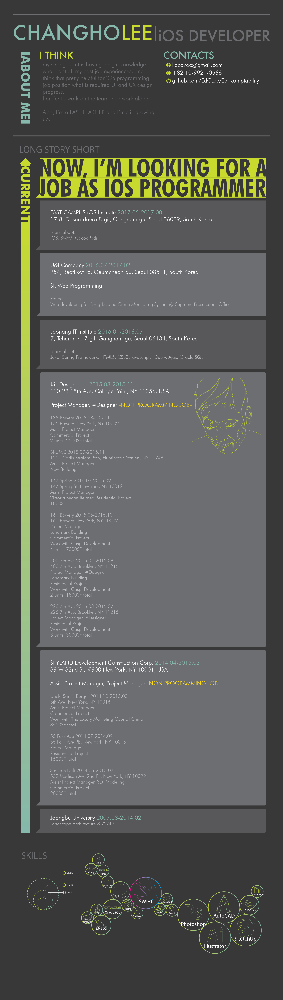

# 
::: About Me :::

 
 

## iOS Class 

#### 00 [Lectures](https://github.com/EdCLee/Ed_komptability/tree/master/00%20Lectures)

- **1st Week : 8 - 12 May**

	> | 
Summary
 | 
Docs
 | 
Practice
 | 
Note
 | 
etc.
 |
	> | :--- | :--- | :--- | :--- | :--- |
	> | [About Computer & Swift](https://github.com/EdCLee/Ed_komptability/tree/master/00%20Lectures/01%20aboutSwift) | [24 pages](https://github.com/EdCLee/Ed_komptability/blob/master/00%20Lectures/01%20aboutSwift/20170508.pdf) || Basic knowledge about computer |
	> | [About Git](https://github.com/EdCLee/Ed_komptability/tree/master/00%20Lectures/02%20aboutGit) | [33 pages](https://github.com/EdCLee/Ed_komptability/blob/master/00%20Lectures/02%20aboutGit/20170509.pdf) |||
	> | [About Object Oriented Programming](https://github.com/EdCLee/Ed_komptability/tree/master/00%20Lectures/03%20객체지향프로그래밍%2C%20인스턴스) | [11 pages](https://github.com/EdCLee/Ed_komptability/blob/master/00%20Lectures/03%20객체지향프로그래밍%2C%20인스턴스/20170510.pdf) | [Calculator](https://github.com/EdCLee/Ed_komptability/tree/master/01%20Programming%20Practice/02%20App%20Practice/01%20Calculator) ||  |
	> | [Variable & Function](https://github.com/EdCLee/Ed_komptability/tree/master/00%20Lectures/04%20변수%2C%20상수%2C%20함수) | [48 pages](https://github.com/EdCLee/Ed_komptability/blob/master/00%20Lectures/04%20변수%2C%20상수%2C%20함수/20170511.pdf) || Include Tuple, In-Out, Types and Type Casting |

- **2nd Week : 15 - 19 May**

	> | 
Summary
 | 
Docs
 | 
Practice
 | 
Note
 | 
etc.
 |
	> | :--- | :--- | :--- | :--- | :--- |
	> | [Control Flow - if](https://github.com/EdCLee/Ed_komptability/tree/master/00%20Lectures/05%20조건문%20if%20%26%20연산자) | [19 Pages](https://github.com/EdCLee/Ed_komptability/blob/master/00%20Lectures/05%20조건문%20if%20%26%20연산자/20170512.pdf) || include if-else, operators ||
	> | [Control Flow - switch](https://github.com/EdCLee/Ed_komptability/tree/master/00%20Lectures/06%20조건문%20switch) | [45 Pages](https://github.com/EdCLee/Ed_komptability/blob/master/00%20Lectures/06%20조건문%20switch/20170515.pdf) || include if-else, operators, Interval Matching, value binding, where ||
	> | [Collection Type & Control Flow - Loop](https://github.com/EdCLee/Ed_komptability/tree/master/00%20Lectures/07%20Collection%20Type%20%26%20반복문%20(while%20%26%20for-in)) | [33 Pages](https://github.com/EdCLee/Ed_komptability/blob/master/00%20Lectures/07%20Collection%20Type%20%26%20반복문%20(while%20%26%20for-in)/20170516.pdf) | [CollatzConjecture](https://github.com/EdCLee/Ed_komptability/blob/master/01%20Programming%20Practice/01%20Algorithm%20Practice/02%20CollatzConjecture/CollatzConjecture/ViewController.swift) / [BaseballGame](https://github.com/EdCLee/Ed_komptability/blob/master/01%20Programming%20Practice/02%20App%20Practice/04%20BaseBallGame/BaseBallGame/ViewController.swift) | include Array, Set, Dictionary, while, for-in, wild card(_) |  |
	> | [Optional & Class](https://github.com/EdCLee/Ed_komptability/tree/master/00%20Lectures/08%20Optional%20%26%20Class) | [37 Pages](https://github.com/EdCLee/Ed_komptability/blob/master/00%20Lectures/08%20Optional%20%26%20Class/20170517.pdf) | [VendingMachine](https://github.com/EdCLee/Ed_komptability/blob/master/01%20Programming%20Practice/02%20App%20Practice/03%20VendingMachine/VendingMachine/ViewController.swift)| include nil, Unwrapping, Optional Binding, Class & Struct, inheritance, Property, init, override |  |
	
- **3rd Week : 22 - 26 May**

	> | 
Summary
 | 
Docs
 | 
Practice
 | 
Note
 | 
etc.
 |
	> | :--- | :--- | :--- | :--- | :--- |
	> | [UIClass](https://github.com/EdCLee/Ed_komptability/tree/master/00%20Lectures/10%20UIView%2C%20UICode%2C%20Asset) | [43 Pages](https://github.com/EdCLee/Ed_komptability/blob/master/00%20Lectures/10%20UIView%2C%20UICode%2C%20Asset/20170522.pdf) | [HelloKittyPixelArt](https://github.com/EdCLee/Ed_komptability/blob/master/00%20Lectures/10%20UIView%2C%20UICode%2C%20Asset/HelloKittyPixelArt/HelloKittyPixelArt/ViewController.swift) | Basic UI Classes | |
	> | [App Life Cycle & Access Control](https://github.com/EdCLee/Ed_komptability/tree/master/00%20Lectures/11%20AppLifeCycle%20%26%20Access%20Control) | [24 Pages](https://github.com/EdCLee/Ed_komptability/blob/master/00%20Lectures/11%20AppLifeCycle%20%26%20Access%20Control/20170523.pdf)|| include AppDelegate ||
	> | [Recursion](https://github.com/EdCLee/Ed_komptability/tree/master/00%20Lectures/12%20Recursion) || [Tower of Hanoi](https://github.com/EdCLee/Ed_komptability/blob/master/01%20Programming%20Practice/01%20Algorithm%20Practice/03%20HanoiTower.playground/Contents.swift) |||
	> | [Class & Struct]() | [32 Pages](https://github.com/EdCLee/Ed_komptability/blob/master/00%20Lectures/13%20Class%20%26%20Struct/20170523.pdf) | [Practice](https://github.com/EdCLee/Ed_komptability/tree/master/00%20Lectures/13%20Class%20%26%20Struct/ClassStructure/ClassStructure) |||
	> | [AutoLayout](https://github.com/EdCLee/Ed_komptability/tree/master/00%20Lectures/14%20AutoLayout) || [Practice](https://github.com/EdCLee/Ed_komptability/tree/master/00%20Lectures/14%20AutoLayout/AutoLauout/AutoLauout) |||
	> | [Delegate & Protocol](https://github.com/EdCLee/Ed_komptability/tree/master/00%20Lectures/15%20Delegate%20%26%20Protocol)|| [Practice](https://github.com/EdCLee/Ed_komptability/blob/master/00%20Lectures/15%20Delegate%20%26%20Protocol/protocolDelegate/protocolDelegate/ViewController.swift)|||
	
- **4th Week : 29 May - 2 June**

	> | 
Summary
 | 
Docs
 | 
Practice
 | 
Note
 | 
etc.
 |
	> | :--- | :--- | :--- | :--- | :--- |
	> |  |  ||||
	
- **5th Week : 7 - 9 June**

	> | 
Summary
 | 
Docs
 | 
Practice
 | 
Note
 | 
etc.
 |
	> | :--- | :--- | :--- | :--- | :--- |
	> |  |  ||||
	
- **6th Week : 12 - 16 June**

	> | 
Summary
 | 
Docs
 | 
Practice
 | 
Note
 | 
etc.
 |
	> | :--- | :--- | :--- | :--- | :--- |
	> |  |  ||||
	
- **7th Week : 19 - 23 June**

	> | 
Summary
 | 
Docs
 | 
Practice
 | 
Note
 | 
etc.
 |
	> | :--- | :--- | :--- | :--- | :--- |
	> |  |  ||||

- **8th Week : 26 - 30 June**

	> | 
Summary
 | 
Docs
 | 
Practice
 | 
Note
 | 
etc.
 |
	> | :--- | :--- | :--- | :--- | :--- |
	> |  |  ||||
	
- **9th Week : 3 - 7 July**

	> | 
Summary
 | 
Docs
 | 
Practice
 | 
Note
 | 
etc.
 |
	> | :--- | :--- | :--- | :--- | :--- |
	> |  |  ||||
	
- **10th Week : 10 - 14 July**

	> | 
Summary
 | 
Docs
 | 
Practice
 | 
Note
 | 
etc.
 |
	> | :--- | :--- | :--- | :--- | :--- |
	> |  |  ||||
	
- **11th Week : 18 - 21 July**

	> ###### Network Lecture
	
- **12th Week : 24 - 28 July**

	> ###### Summarize with Firebase and instagram API

 
---
 
	
#### 01 [Programming Practice](https://github.com/EdCLee/Ed_komptability/tree/master/01%20Programming%20Practice)	
#### 02 [Projects](https://github.com/EdCLee/Ed_komptability/tree/master/02%20Projects)

#### 03 [Samples For Reference](https://github.com/EdCLee/Ed_komptability/tree/master/03%20Samples(ForReference))

#### 99 [Quiver slots for fast coding](https://github.com/EdCLee/Ed_komptability/tree/master/99%20Quiver)

 
 
 

## Contact me here,

Junior iOS Developer, 
Changho Lee
 
 

 

Contacts
 

 

