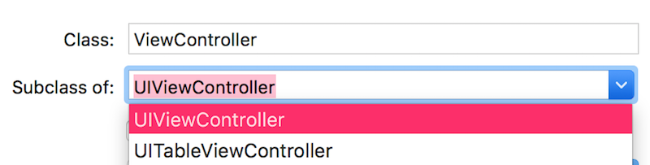
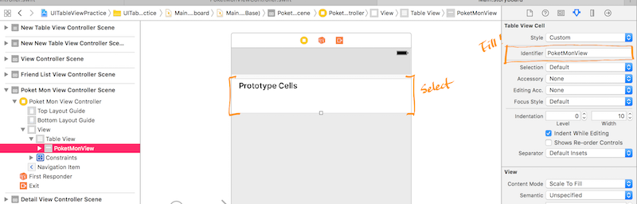

# Navigation Bar
> 인터페이스를 관리하는 뷰, 외관은 custom이 가능하지만 frame, bounds, or alpha values는 절대 직접 바꿀 수 없다.

<br>


<br>

- Navigation bar에 들어가는 아이템도 custom해서 사용 가능하다.

	|left|center|right|
	|---|---|---|

	- left : backBarButtonItem, leftBarButtonItem
	- center : titleView
	- right : rightBarButtonItem|

## Custom NavigationBar

- 화면전환을 하다보면 히든을 시켜놔도 다시 나타나기도 하므로 위치와 시점을 잘 고려해서 사용해야 한다.

```swift
	self.navigationController?.isNavigationBarHidden = true
```

- bar button items에서 버튼에 관련된 customizing도 가능하다.

<br>
<br>
<br>

# UITableView
> 리스트의 형태로 정보를 보여주는 View
> 
> ScrollView를 상속받은 UI의 꽃!

<br>

## style
> 스타일(형태)는 plain, Grouped가 있다.

#### Plain Table Views
- 기본적인 TableView
- 여러개의 Section을 가질 수 있다.
- 한 Section에는 여러개의 Row를 포함하고 있다.
- 각각의 Section에는 Section을 표시 하는 header, footer title을 표시할 수 있다.
- Section을 빠르게 검색할 수 있는 네비게이터 바를 index list라고 부른다.

#### Grouped Table Views

<br>

## Protocol
> DataSource와 Delegate 두 가지 Protocol을 모두 구현할 줄 알아야 한다.

#### DataSource
- 프로토콜을 사용하여 테이블 뷰에서 보여줄 데이터를 관리할 대리인의 역할을 정의해둔것.
- 역할
	- @requires
		- 테이블 뷰의 각 섹션별 열의 개수를 설정 `NUmberOfRowsInSection section: Int`
		- Row별 Cell객체 `cellForRowAt indexPath: IndexPath`
			- **IndexPath**에는 Row와 Section의 값을 가지고 있다.
	- @Optional
		- 테이블 뷰 섹션의 개수를 설정 `func numberOfSections(in tableView: UITableView)`

```swift
public protocol UITableViewDataSource : NSObjectProtocol {
    
    @available(iOS 2.0, *)
    public func tableView(_ tableView: UITableView, numberOfRowsInSection section: Int) -> Int
    
    // Row display. Implementers should *always* try to reuse cells by setting each cell's reuseIdentifier and querying for available reusable cells with dequeueReusableCellWithIdentifier:
    // Cell gets various attributes set automatically based on table (separators) and data source (accessory views, editing controls)
    
    @available(iOS 2.0, *)
    public func tableView(_ tableView: UITableView, cellForRowAt indexPath: IndexPath) -> UITableViewCell
    
    @available(iOS 2.0, *)
    optional public func numberOfSections(in tableView: UITableView) -> Int // Default is 1 if not implemented
    
    @available(iOS 2.0, *)
    optional public func tableView(_ tableView: UITableView, titleForHeaderInSection section: Int) -> String? // fixed font style. use custom view (UILabel) if you want something different

    @available(iOS 2.0, *)
    optional public func tableView(_ tableView: UITableView, titleForFooterInSection section: Int) -> String?
```

<br>

#### Delegate
- 프로토콜을 사용하여 테이블뷰의 대리자로써의 수행할 수 있는 역할들을 정의해 둔 것.
- 역할
	- 헤더 또는 풋터의 높이를 설정 : `Variable heigh support`
	- 헤더 또는 풋터 뷰를 제공 : `Section Informations`
	- 셀을 선택하였을 때 수행할 동작 관리 : `Selection`
	- 셀이 삭제 될 때의 동작 등의 관리 : `Editing
	- ...

###### TableView 예제

1. storyboard에  View Controller를 생성하고 새로 만든 ViewController.swift와 연결을 한다.

	

2. let friendsCell = tableView.dequeueReusableCell(withIdentifier: "inspectorIdHere", for: indexPath) 에서 withIdentifier로 뷰를 연결하기 위해 연결할 대상의 id를 입력해야한다.

	

3. <kbd>control</kbd> + 드래그
 
	

4. dataSource, delegate를 선택한다.

	
	
	<br>

```swift
//TableView를 사용하려면 UITableViewDataSource를 가져와야 한다.
//높이등의 설정을 할땐 UITableViewDelegate를 가져와야 한다.
class FriendListViewController: UIViewController, UITableViewDataSource, UITableViewDelegate {

    // 친구리스트 array 변수 선언
    var friendList:[String]?
    
    override func viewDidLoad() {
        super.viewDidLoad()

        // 데이터를 담는다.
        friendList = ["A", "B", "C", "D", "E", "F"]
        
        // Do any additional setup after loading the view.
    }

    override func didReceiveMemoryWarning() {
        super.didReceiveMemoryWarning()
        // Dispose of any resources that can be recreated.
    }
    
    // section의 갯수를 지정.
    // return 10 하면 10개가 생김.
//    func numberOfSections(in tableView: UITableView) -> Int {
//        return
//    }

    
    // 한 section에 들어가게 될 row의 수를 지정.
    // friendList array의 갯수를 count해서 사용한다.
    func tableView(_ tableView: UITableView, numberOfRowsInSection section: Int) -> Int {
        let count = friendList?.count ?? 0
        return count
    }
    
    // withIdentifier에 지정해주는 id값은 storyboard에서 tableview로 
    // 사용될 Table View Cell의 Attribute inspector에 있는 identifier에 있는 값을 넣어주어야 한다.
    func tableView(_ tableView: UITableView, cellForRowAt indexPath: IndexPath) -> UITableViewCell {
        let friendsCell = tableView.dequeueReusableCell(withIdentifier: "inspectorIdHere", for: indexPath)
        
        friendsCell.textLabel?.text = friendList?[indexPath.row]
        
        return friendsCell
    }
    
    // section에 넣을 이름
    func tableView(_ tableView: UITableView, titleForHeaderInSection section: Int) -> String? {
        return String(section)
        
    }
    
    // row 높이
    func tableView(_ tableView: UITableView, heightForRowAt indexPath: IndexPath) -> CGFloat {
        return 10
    }
    
    // section 높이
    func tableView(_ tableView: UITableView, heightForHeaderInSection section: Int) -> CGFloat {
        return 10
    }
}
```

#### UITableViewCell
- display text, images or other kinds of content.
- background views for both normal and selected states.
- cells can also have accessory views.

<br>

**기본적으로!**
	
- contentView
	- textLabel
	- detailTextLabel
	- imageView
- accessoryView
	
를 가지고 있는 구조이다.

###### UITableViewCell 예제
테이블 예제와 같은 방식으로 storyboard에서의 작업 후

###### PoketMonViewController.swift

```swift
class PoketMonViewController: UIViewController, UITableViewDataSource, UITableViewDelegate {
    
    override func viewDidLoad() {
        super.viewDidLoad()

        // Do any additional setup after loading the view.
    }

    override func didReceiveMemoryWarning() {
        super.didReceiveMemoryWarning()
        // Dispose of any resources that can be recreated.
    }
    
    func numberOfSections(in tableView: UITableView) -> Int {
        return 1
    }
    
    func tableView(_ tableView: UITableView, numberOfRowsInSection section: Int) -> Int {
        //PoketMonData class안에 변수가 property type으로 사용하기 위해 static을한 경우
        return PoketMonData.names.count
        
        //PoketMonData class안에 변수가 static이 아닌경우
        //let PoketMon:PoketMonData = PoketMonData()
        //return PoketMon.names.count
        
    }  
    
    func tableView(_ tableView: UITableView, cellForRowAt indexPath: IndexPath) -> UITableViewCell {
        let cell = tableView.dequeueReusableCell(withIdentifier: "PoketMonView", for: indexPath)
        
        cell.textLabel?.text = PoketMonData.names[indexPath.row]
        cell.imageView?.image = UIImage(named : "\(indexPath.row + 1)")
        cell.selectionStyle = UITableViewCellSelectionStyle.default
        
        return cell
    } 
    
    func tableView(_ tableView: UITableView, heightForRowAt indexPath: IndexPath) -> CGFloat {
        return 100
    }
    
    func tableView(_ tableView: UITableView, didSelectRowAt indexPath: IndexPath) {
        print("작동 안되는 중")
        let storyboard:UIStoryboard = UIStoryboard(name: "Main", bundle: nil)
        let nextVC:DetailViewController = storyboard.instantiateViewController(withIdentifier: "DetailView") as! DetailViewController
        
        nextVC.imageName = "\(indexPath.row+1)"
        nextVC.titleName = PoketMonData.names[indexPath.row]
        
        self.navigationController?.pushViewController(nextVC, animated: true)
    
        tableView.deselectRow(at: indexPath, animated: true)
        
        print(nextVC.imageName!)
        print(nextVC.titleName!)
    }   
}
```

###### DetailViewController

```swift
class DetailViewController: UIViewController {
    
    @IBOutlet weak var selectedPoketMon: UIImageView!
    @IBOutlet weak var expressionOfSelection: UILabel!
    
    var imageName:String?
    var titleName:String?
    
    
    override func viewDidLoad() {
        super.viewDidLoad()

        let imageName = self.imageName ?? "DefaultImageName"
        let titleName = self.titleName ?? "?"
        
        selectedPoketMon.image = UIImage(named: imageName)
        expressionOfSelection.text = titleName
    
    }

    override func didReceiveMemoryWarning() {
        super.didReceiveMemoryWarning()
        // Dispose of any resources that can be recreated.
    }

}
```